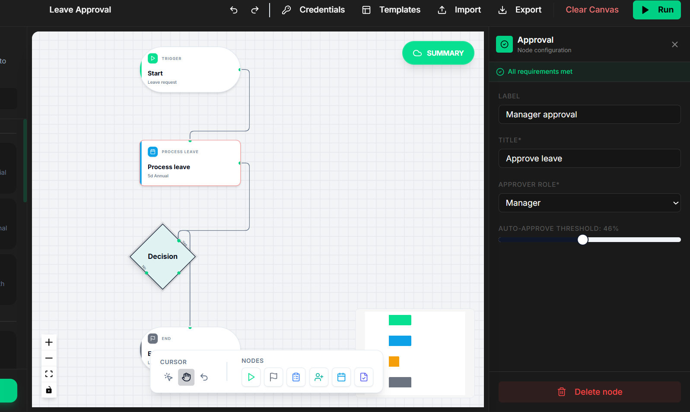
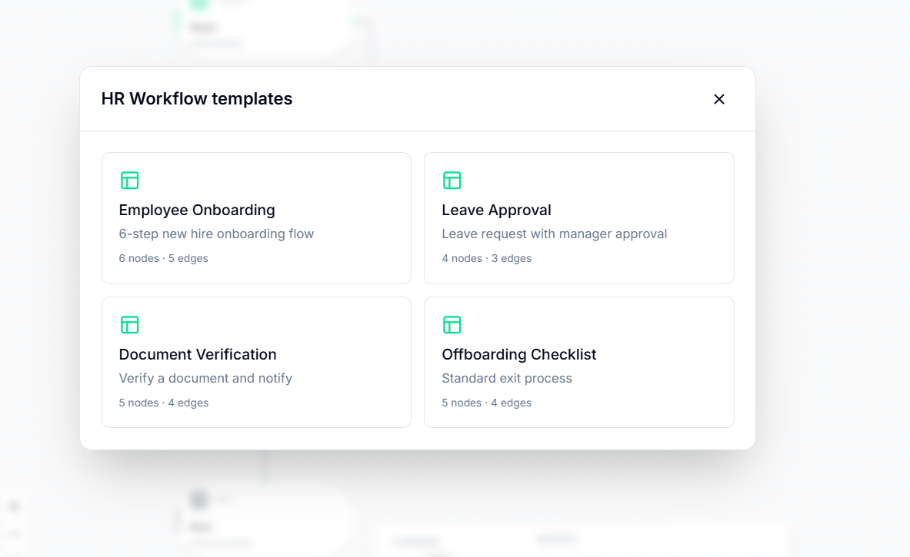
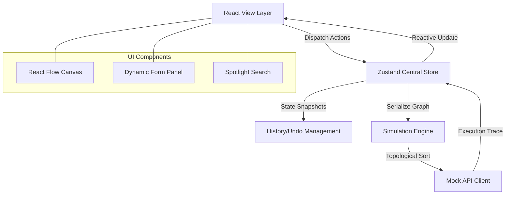

# AxonHR | Workflow Designer Prototype

## Introduction
The AxonHR Workflow Designer is a high-fidelity prototype developed for the HR Automation Case Study. It provides a formal environment for the design, validation, and simulation of operational HR workflows through an interactive canvas interface.

---

## 1. Project Deliverables
The following components are fully implemented within this repository:
1. React 18 Application (Vite framework)
2. React Flow Canvas with 12+ Specialized Custom Nodes
3. Node Configuration Forms with Dynamic Field Injection
4. Local Mock API Integration
5. Sandbox Simulation Panel with Execution Trace
6. Technical Documentation covering Architecture and Rationale

---

## 2. Functional Requirements

### 2.1 Workflow Canvas Operations

The application implements a multi-functional workspace supporting:
* Drag-and-drop node instantiation from a categorized sidebar.
* Logical edge connectivity between HR procedural steps.
* Targeted node selection for real-time property configuration.
* Structural lifecycle management (Delete nodes/edges and Clear Canvas).
* Background graph validation for structural integrity.

### 2.2 Node Configuration & Data Modeling

The system provides specialized nodes with rigorous data field requirements:
* **Start Node**: Title and Metadata support.
* **Task Node**: Mandatory Title, Description, Assignee, and Date fields.
* **Approval Node**: Role-based routing (Manager, HRBP, Director) with auto-approve logic.
* **Automated Step**: Dynamic action mapping from the mock API response.
* **End Node**: Performance summary flags and workflow termination logic.

---

## 3. Sandbox Simulation

The Sandbox Simulation environment provides formal testing capabilities:
* **Serialization**: Complete graph state conversion to JSON for API delivery.
* **Backend Integration**: Direct communication with the mock /simulate endpoint.
* **Execution Trace**: Step-by-step timeline UI displaying node status and duration.
* **Structural Auditing**: Automated detection of circular loops and orphaned logic.

---

## 4. Premium Add-on Features

### Templates & Quick Start patterns

### Command Palette & Quick Build

The Spotlight Command Center (`⌘K`) enables rapid canvas interaction, while the NLP Quick Build system allows for text-to-graph workflow generation.

### Artificial Intelligence Summarization

A context-aware summary engine translates complex node networks into human-readable briefs for stakeholder review.

---

## 5. Technical Architecture

The application following a modular three-tier architecture, as visualized below:

### Architecture Overview
1. **View Layer**: React 18 and React Flow manage the visual graph and UI components.
2. **State Layer**: Zustand with Immer middleware provides a centralized, immutable store for graph data and history snapshots.
3. **Mock API Layer**: A standalone client implementation simulates asynchronous backend services with topological sorting logic.

---

## 6. Design Choices
* **Atomic Component Design**: Every node type inherits from a base `NodeShell`, ensuring visual consistency and centralized management of interaction states (Selected, Running, Failed).
* **Controlled Form Pattern**: Configuration forms use controlled inputs with Zod schema validation to prevent malformed data from entering the graph.
* **Topological Execution**: Simulation results are determined using a topological sort algorithm, ensuring that the execution order strictly follows the logical flow defined by the user.

---

## 7. Technical Assumptions
* **DAG Limitation**: The simulation engine assumes the workflow is a Directed Acyclic Graph (DAG). If cycles are detected, simulation is gated to prevent infinite execution loops.
* **Connectivity**: The system assumes every workflow must have exactly one Start node to serve as a valid entry point for the simulation engine.
* **Local Persistence**: Data is managed in-memory via the Zustand store; persistent backend storage was explicitly excluded per the project brief.

---

## 8. Operational Guide

| Shortcut | Action |
| :--- | :--- |
| `⌘K` | Command Palette (Search/Build) |
| `⌘Z` / `⌘Y` | Undo / Redo timeline |
| `S` / `P` | Selection / Pan Mode |
| `Del` | Delete selected element |
| `Esc` | Clear selection |

### Setup Instructions
1. Run `npm install` to resolve dependencies.
2. Run `npm run dev` to start the interface.
3. Access the designer at `http://localhost:5173`.
