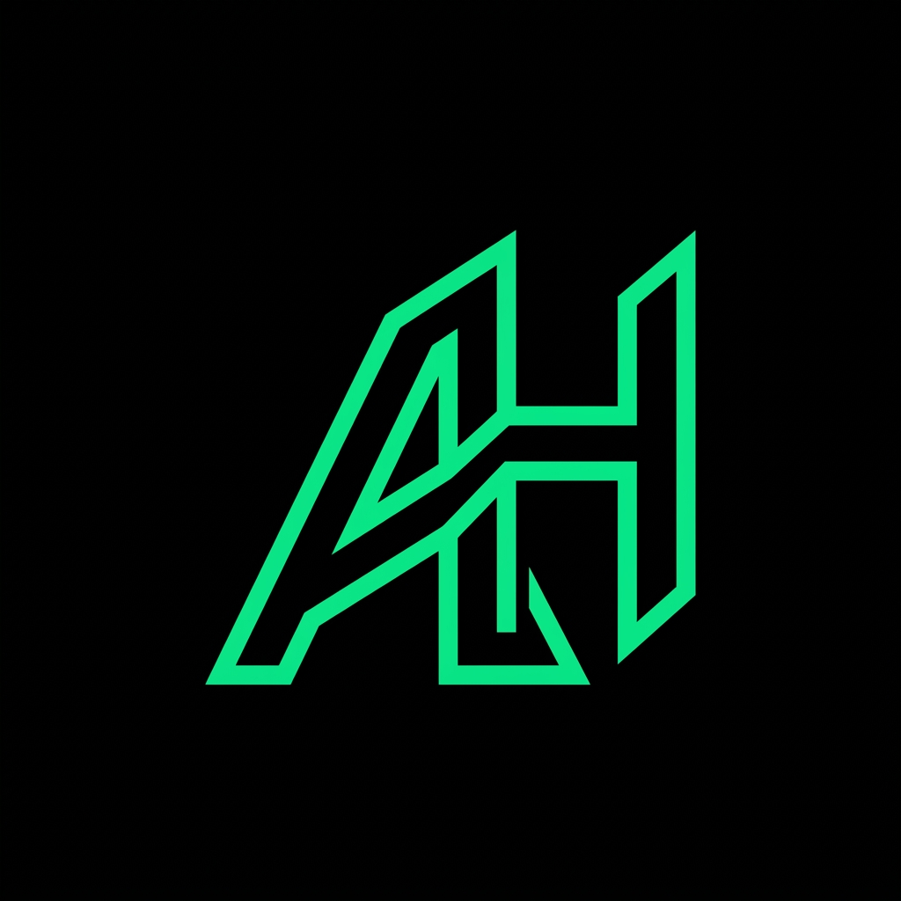
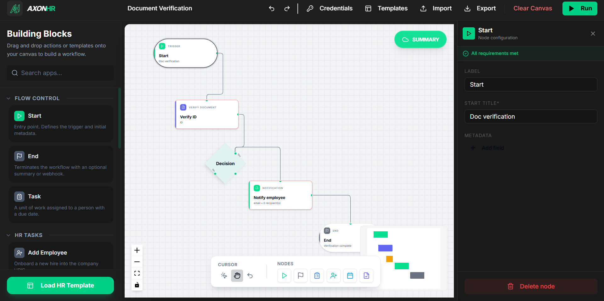
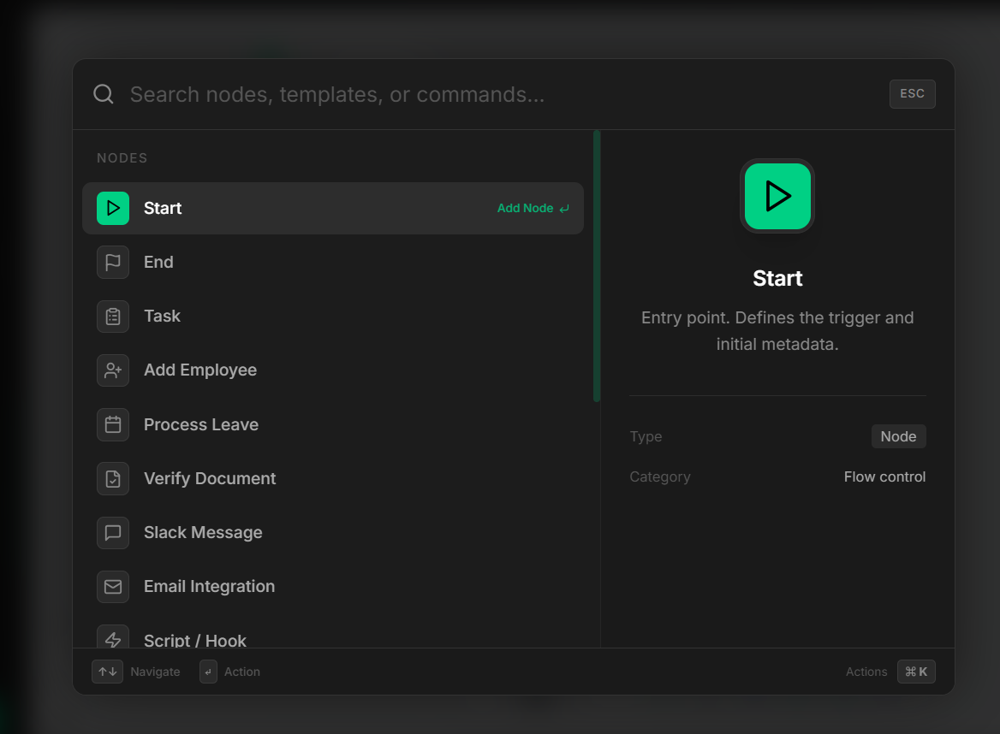
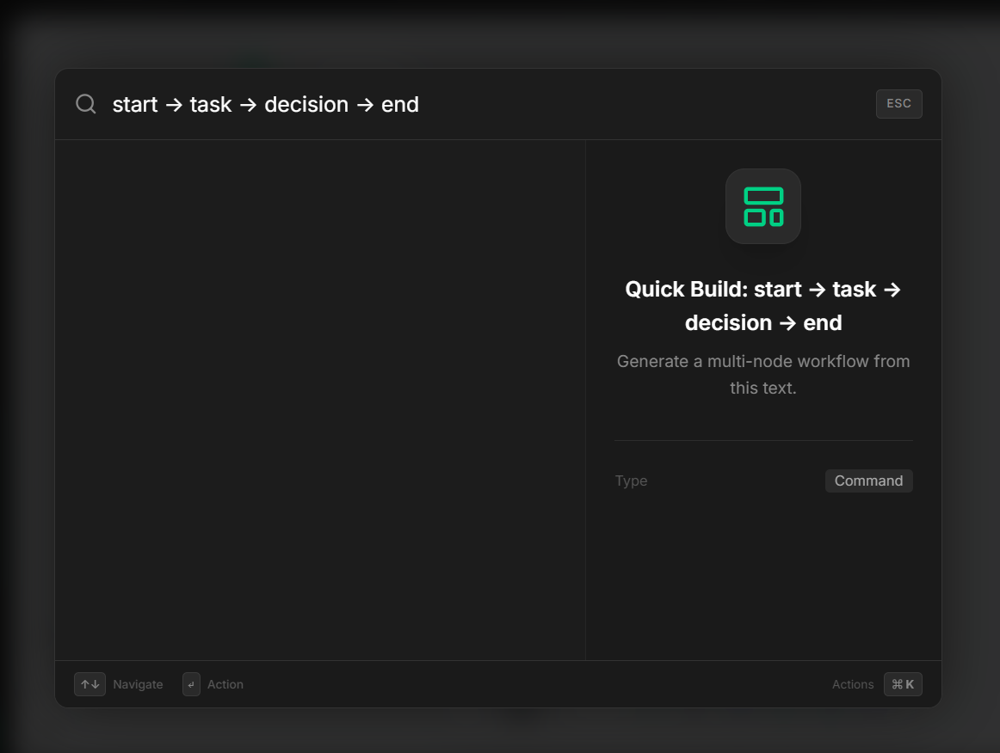
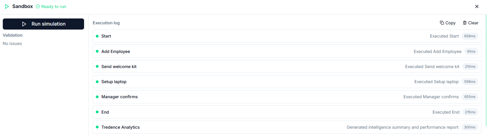

# AxonHR | Workflow Designer Prototype

## Introduction
The AxonHR Workflow Designer is a high-fidelity prototype developed for the HR Automation Case Study. It provides a modern, interactive canvas environment for designing and simulating operational HR workflows.

---

## 1. Functional Requirements Compliance
This project strictly adheres to the submission guidelines, implementing all mandatory node types and canvas actions.

### Node Connectivity & Editing

*   **Integrated Workflow Canvas**: Built on React Flow with support for drag-and-drop, custom connections, and sub-pixel grid alignment.
*   **Dynamic Configuration Sidebar**: A context-aware panel for each node type, utilizing controlled components and Zod-backed validation.
*   **Advanced Node Forms**: All mandatory fields are implemented:
    *   **Start**: Title and Metadata (Key-Value Editor).
    *   **Task**: Title, Description, Assignee, and Due Date.
    *   **Approval**: Title, Role-based Routing (Manager, HRBP, Director), and Auto-Approve Thresholds.
    *   **Automated Step**: Title and dynamic Action selection from the Mock API.
    *   **End**: Exit message and Performance Summary Toggle.

---

## 2. Advanced Feature Suite

### Spotlight Command Center (`⌘K`)

A unified command palette that allows for instant node insertion, template application, and canvas navigation.

### Natural Language "Quick Build"

An innovative text-to-graph parser that transforms semantic input (e.g., `Start -> Task -> Approval -> End`) into functional graph structures.

---

## 3. Technical Architecture & Mock API Layer

A lightweight API layer has been implemented in `src/api/client.ts` to simulate production backend interactions.

### API Endpoint Specifications
*   **`GET /automations`**: Provides dynamic metadata for system nodes, returning actions with custom parameter definitions.
*   **`POST /simulate`**: Accepts the full workflow serialization and returns a step-by-step execution log.
*   **Topological Sorting**: The engine automatically determines the valid execution sequence for HR tasks using DAG principles.

---

## 4. Workflow Testing / Sandbox Panel

The Sandbox panel serves as the primary validation and testing environment.
1.  **Serialization**: Captures the entire graph state before submission.
2.  **Structural Validation**: Background checks for circular dependencies, orphaned nodes, and missing connections.
3.  **Real-Time Simulation**: Executes a mock run of the workflow, displaying status updates (`passed`, `running`, `skipped`) and execution speed for each node.

---

## 5. Technical Stack & State Management
*   **Framework**: React 18 (Vite) + TypeScript.
*   **Canvas Engine**: React Flow.
*   **State**: Zustand with Immer middleware for immutable timeline management (Undo/Redo).
*   **Validation**: Zod + custom graph traversal algorithms.
*   **UI/UX**: Tailwind CSS with a custom "Greptile Green" professional skin.

---

## 6. Operational Guide

| Shortcut | Action |
| :--- | :--- |
| `⌘K` | Command Palette (Search/Build) |
| `⌘Z` / `⌘Y` | Undo / Redo timeline |
| `S` / `P` | Selection / Pan Mode |
| `Del` | Delete selected element |
| `Esc` | Clear selection |

### Installation
1. `npm install`
2. `npm run dev`
3. Open `http://localhost:5173`

---

Developed by the AxonHR Engineering Team for Tredence Analytics.
