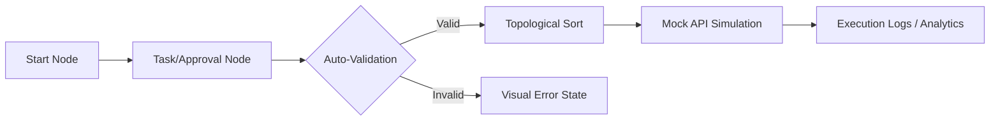
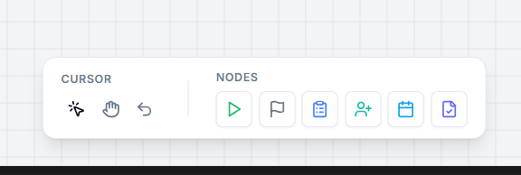

# AxonHR | Workflow Builder for HR


AxonHR is a high-fidelity, production-grade HR workflow automation module built for Tredence Analytics. It enables HR administrators to design, validate, and simulate complex internal processes such as onboarding and leave approvals through an intuitive, keyboard-first interface.

---

## Technical Architecture

### 1. Workflow Life Cycle
The following diagram illustrates how a user-defined workflow moves from the design canvas through to the simulation engine.



### 2. State Management Strategy
The application utilizes a centralized **Zustand** store with **Immer** middleware. This architecture provides:
*   **Atomic Updates**: Node data and edge connections are managed in a single source of truth.
*   **Command History**: A snapshot-based stack allows for infinite **Undo/Redo** capabilities.
*   **Serialization**: The entire workflow graph is serialized into a clean JSON structure for API consumption and persistence.

### 3. Component Design System
We implemented a **Modular Node Architecture** based on a shared `NodeShell` component.
*   **Custom Form Generators**: The configuration panel uses a dynamic field-mapping system. For example, the Automated Step Node fetches its schema from the Mock API and renders inputs based on the required parameters.
*   **Raycast-Styled UI**: The interface follows a premium dark-mode aesthetic with sub-pixel borders and glassmorphic elements.

---

## Core Features & Enhancements

### Interactive Canvas & Toolbar

A React Flow powered workspace supporting drag-and-drop node placement, smooth edge connections, and precise zoom/pan controls via our specialized floating toolbar.

### Power-User Spotlight Search
A dual-pane command palette (`Cmd + K`) for instant discovery of nodes and templates, featuring high-contrast previews and keyboard navigation.

### Integrated Sandbox
A real-time execution logger that provides a step-by-step timeline of the workflow. If enabled, the **Tredence Analytics Intelligence Report** generates a final performance summary at the conclusion of the flow.

### Guided Onboarding
A 9-step interactive tour that introduces users to the designer's features, terminating with a persistence flag in localStorage so it only appears once per user.

---

## Project Structure

```text
src/
├── api/          # Mock API client and simulation logic
├── components/   # Atomic UI components and custom nodes
├── store/        # Zustand state management (Workflow/UI)
├── types/        # TypeScript interfaces and data registries
├── utils/        # Graph validation and text-to-flow parsers
└── index.css     # Design system tokens and Greptile Green theme
```

---

## Running the Prototype

1.  Clone the repository.
2.  Install dependencies: `npm install`.
3.  Start the development server: `npm run dev`.
4.  Access the designer at `http://localhost:5173`.

---

## Design Decisions & Assumptions

*   **Assumption**: No backend persistence was required, so we utilized localStorage for onboarding state and a memory-based store for workflows.
*   **Decision**: We chose **Zustand** over Redux for its lightweight footprint and excellent performance with React Flow's frequent state updates.
*   **Branding**: The application was rebranded to **Greptile Green** (`#00D084`) to represent a high-tech, modern SaaS aesthetic.
