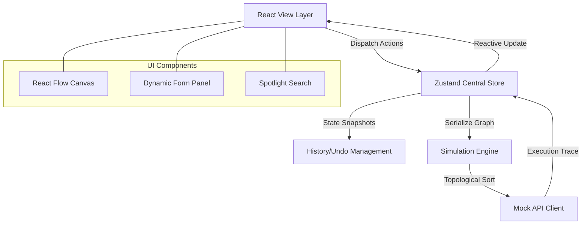
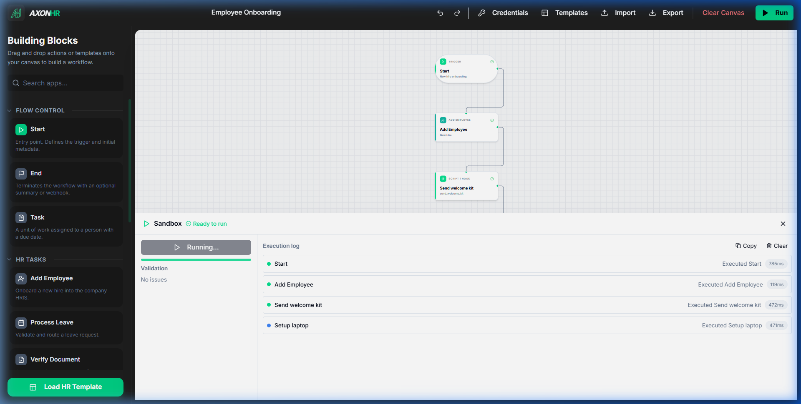
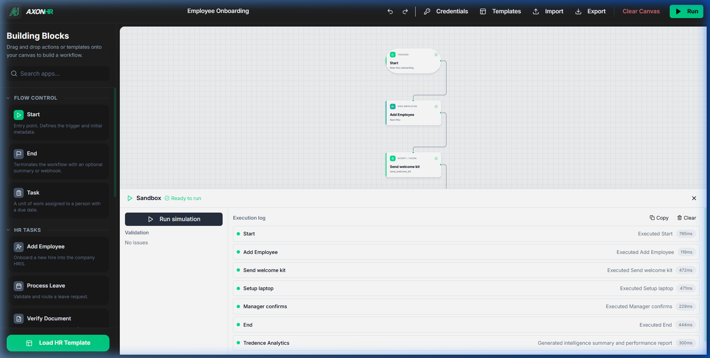

# AxonHR | Workflow Designer Prototype

**Live Demo: [axon-hr.vercel.app](https://axon-hr.vercel.app)**

## Introduction
The AxonHR Workflow Designer is a high-fidelity prototype developed for the HR Automation Case Study. It provides a formal environment for the design, validation, and simulation of operational HR workflows through an interactive canvas interface.

---

## 1. Project Deliverables
The following components are fully implemented within this repository:
1. React 18 Application (Vite framework)
2. React Flow Canvas with 12+ Specialized Custom Nodes
3. Node Configuration Forms with Dynamic Field Injection
4. Local Mock API Integration
5. Sandbox Simulation Panel with Execution Trace
6. Technical Documentation covering Architecture and Rationale

---

## 2. Functional Requirements

### 2.1 Workflow Canvas Operations

The application implements a multi-functional workspace supporting:
* Drag-and-drop node instantiation from a categorized sidebar.
* Logical edge connectivity between HR procedural steps.
* Targeted node selection for real-time property configuration.
* Structural lifecycle management (Delete nodes/edges and Clear Canvas).
* Background graph validation for structural integrity.

### 2.2 Node Configuration & Data Modeling

The system provides specialized nodes with rigorous data field requirements:
* **Start Node**: Title and Metadata support.
* **Task Node**: Mandatory Title, Description, Assignee, and Date fields.
* **Approval Node**: Role-based routing (Manager, HRBP, Director) with auto-approve logic.
* **Automated Step**: Dynamic action mapping from the mock API response.
* **End Node**: Performance summary flags and workflow termination logic.

---

## 3. Technical Architecture

The application follows a modular three-tier architecture, as visualized below:

### Architecture Overview
1. **View Layer**: React 18 and React Flow manage the visual graph and UI components.
2. **State Layer**: Zustand with Immer middleware provides a centralized, immutable store for graph data and history snapshots.
3. **Mock API Layer**: A standalone client implementation simulates asynchronous backend services with topological sorting logic.

---

## 4. Input & Output (Execution Workflow)

The Sandbox Simulation environment provides a robust testing loop for validating HR logic.

### 4.1 Property Input & Execution Output
The system transforms user-defined properties (Inputs) into actionable execution logs (Outputs).

**Example Scenario: Employee Onboarding**
*   **Input**: The user selects the *Add Employee* node and sets the `employeeName` property to **"Kaveen"** and `role` to **"Engineer"**.
*   **Engine Logic**: Upon running the simulation, the system ingests this state and validates the parameters.
*   **Output**: The Simulation Panel outputs a success state: *"Employee Kaveen successfully added as Engineer"*, appearing in the formal execution log with a timestamp and duration.

### 4.2 Simulation Feedback Loop

*   **Live Status**: Nodes on the canvas respond instantly with verified status icons (spinners for running, green checks for success).
*   **Tracing**: The execution log provides a high-fidelity audit trail, showing exactly how each "Input" configuration resulted in a specific "Output" trace.

---

## 5. Enterprise Integrations (Slack & Email)
AxonHR features native support for automated communication channels to streamline HR notifications.

### 5.1 Slack Integration
The **Slack Node** enables instant team notifications through dedicated channels.
*   **Input Capability**: Configurable Channel Name (e.g., `#new-hires`), Message Template, and User Tagging.
*   **Execution Logic**: The simulation validates channel accessibility and formats the payload for the mock API.
*   **Output**: Confirms message delivery in the execution log: *"Published onboarding alert to Slack channel #new-hires"*.

### 5.2 Email Automation
The **Email Node** handles formal corporate communication.
*   **Input Capability**: Recipient Email Address, Subject Line, and Dynamic Body content.
*   **Credential Linking**: Inherits verification from the centralized Credentials Manager.
*   **Output**: Captures SMTP handoff status: *"Welcome email successfully dispatched to kaveen@company.com"*.

---

## 6. Design Choices
* **Atomic Component Design**: Every node type inherits from a base `NodeShell`, ensuring visual consistency and centralized management.
* **Controlled Form Pattern**: Configuration forms use controlled inputs with Zod schema validation to ensure graph integrity.
* **Topological Execution**: Results are determined using a topological sort algorithm to ensure strict procedural order.

---

## 7. Technical Assumptions
* **DAG Limitation**: The simulation engine assumes the workflow is a Directed Acyclic Graph (DAG) to prevent infinite loops.
* **Connectivity**: The system requires exactly one Start node to serve as the valid entry point.
* **Local Persistence**: Data is managed in-memory via the Zustand store per the project brief.

---

## 8. Premium Add-on Features

### Templates & Quick Start patterns

### Command Palette & Quick Build

### Artificial Intelligence Summarization

---

## 9. Operational Guide

| Shortcut | Action |
| :--- | :--- |
| `⌘K` | Command Palette (Search/Build) |
| `⌘Z` / `⌘Y` | Undo / Redo timeline |
| `S` / `P` | Selection / Pan Mode |
| `Del` | Delete selected element |
| `Esc` | Clear selection |

### Setup Instructions
1. Run `npm install` to resolve dependencies.
2. Run `npm run dev` to start the interface.
3. Access the designer at `http://localhost:5173`.
