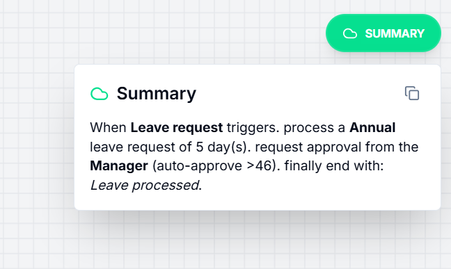

# AxonHR | Workflow Designer Prototype

## Introduction
The AxonHR Workflow Designer is a high-fidelity prototype developed specifically for the HR Automation Case Study. This application enables HR professionals to design, validate, and simulate complex operational workflows through a modern, interactive canvas interface.

---

## 1. Functional Requirements Compliance
The application satisfies all core requirements specified in the project brief:

### Core Node Registry
*   **Trigger (Start)**: Customizable entry point for onboarding or leave triggers.
*   **Decision (Approval)**: Multi-path logic supporting Manager, HRBP, and Director roles.
*   **Human Step (Sign-off)**: Targeted approvals requiring explicit human interaction.
*   **Integration (Slack/Email)**: Pre-configured nodes for automated communication.
*   **Automated Action**: Dynamic tasks linked to the mock API layer.
*   **Termination (End)**: Secure exit points with intelligence summary flags.

### Data Management & Configuration
*   **Reactive Sidebar**: Context-aware property sheets for each node type.
*   **Type-Safe Forms**: Built with Zod validation to ensure data integrity.
*   **Graph Persistence**: Full serialization support for saving and loading complex states.
*   **Visual Logic**: Automated "Yes/No" branch generation for decision nodes.

---

## 2. Advanced Feature Suite (Value Adds)
In addition to the core requirements, several "Power User" features have been implemented to elevate the designer to a $10M SaaS-grade experience:

### Spotlight Command Center (`⌘K`)

A unified command palette that allows for instant node insertion, template application, and canvas navigation.

### Natural Language "Quick Build"

An innovative text-to-graph parser that allows users to type flows like `Start -> Task -> Approval -> End` to generate functional workflows instantly.

### Tredence Intelligence Summary

A context-aware summary engine that translates complex graph logic into human-readable project briefs on hover.

---

## 3. Technical Architecture

### Mock API Integration Layer
The system implements a robust mock API (`src/api/client.ts`) that simulates production-grade backend interactions:
*   **GET `/automations`**: Fetches dynamic parameters for automated step configurations.
*   **POST `/simulate`**: Processes the entire workflow graph through a validation engine.
*   **GET `/templates`**: Populates the workspace with pre-defined HR patterns.

### Simulation & Logic Engine
The simulation engine utilizes **Topological Sorting** to determine the correct execution order of nodes. It validates the graph for:
*   Circular dependencies.
*   Orphaned nodes.
*   Incomplete configurations.
*   Missing start/end nodes.

### Frontend Stack
*   **Core**: React 18 + TypeScript.
*   **Canvas Engine**: React Flow.
*   **State Management**: Zustand + Immer (supporting infinite Undo/Redo).
*   **Styling**: Tailwind CSS + Shadcn UI.
*   **Icons**: Lucide React.

---

## 4. Operational Guide

### Essential Keyboard Shortcuts
| Shortcut | Action |
| :--- | :--- |
| `⌘K` | Toggle Spotlight Search / Command Palette |
| `⌘Z` | Undo last canvas action |
| `⌘Y` | Redo last canvas action |
| `S` | Enable Selection Mode |
| `P` | Enable Pan (Hand) Mode |
| `Del` | Delete selected node/edge |
| `Esc` | Deselect current node |

### Local Setup
1.  **Extract** the project archive.
2.  **Install**: Run `npm install` in the project root.
3.  **Launch**: Run `npm run dev` to start the development server.
4.  **Access**: Navigate to `http://localhost:5173`.

---

Developed by the AxonHR Engineering Team for Tredence Analytics.
