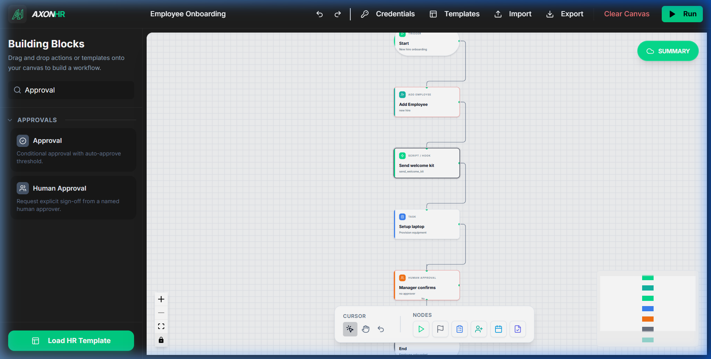
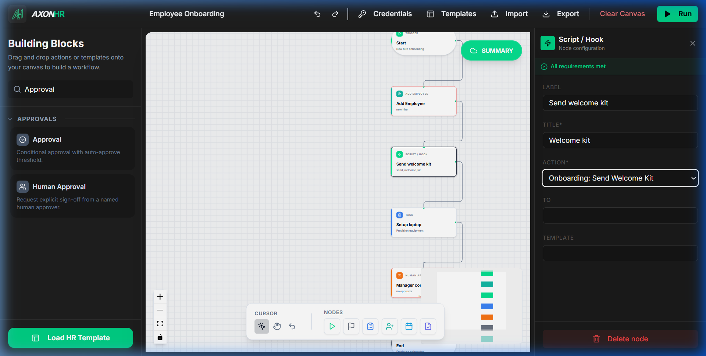
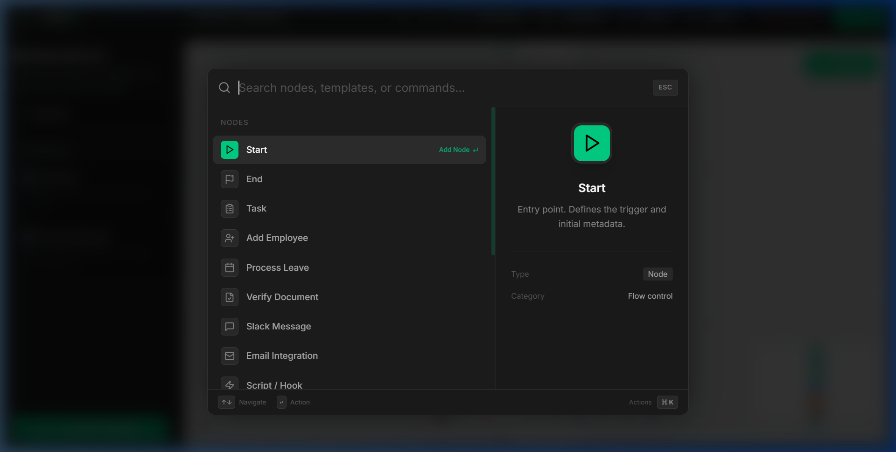
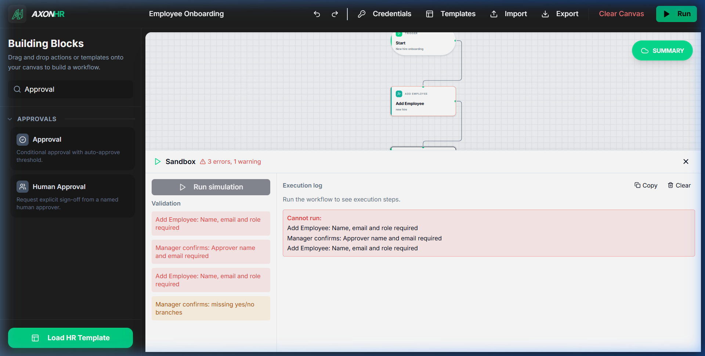
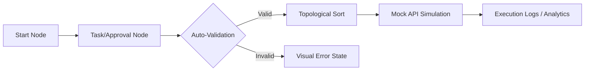

# AxonHR | Workflow Builder for HR

AxonHR is a high-fidelity, production-grade HR workflow automation module built for Tredence Analytics. It enables HR administrators to design, validate, and simulate complex internal processes such as onboarding and leave approvals through an intuitive, keyboard-first interface.

---

## 📋 Requirement Compliance Checklist

The project was built to satisfy all the core requirements of the Case Study. Each functional requirement is mapped to its implementation below.

### 1. Workflow Canvas (React Flow)
**Requirement**: Implement a drag-and-drop canvas with five custom node types (Start, Task, Approval, Automated, End), connection edges, and node selection/deletion.

*   **Status**: Completed with high-fidelity visual feedback and sub-pixel grid system.

### 2. Node Configuration Forms
**Requirement**: Editable form panels for each node type with specific minimum fields (e.g., auto-approve threshold, assignee, due date).

*   **Status**: Completed using controlled components and the **Greptile Green** design system.

### 3. Mock API & Automated Actions
**Requirement**: Integrate a mock API for `/automations` and dynamic parameter generation.

*   **Status**: Completed. Action parameters update dynamically based on the selected mock automation (e.g. Email vs. Slack).

### 4. Simulation Sandbox
**Requirement**: A testing panel that serializes the graph, validates structure, and displays execution logs.

*   **Status**: Completed with a **Topological-Sort** engine and real-time execution timeline.

---

## Technical Architecture

### Workflow Life Cycle

### State Management Strategy
The application utilizes a centralized **Zustand** store with **Immer** middleware. This architecture provides:
*   **Atomic Updates**: Node data and edge connections are managed in a single source of truth.
*   **Command History**: A snapshot-based stack allows for infinite **Undo/Redo** capabilities.
*   **Serialization**: The entire workflow graph is serialized into a clean JSON structure for API consumption and persistence.

---

## Core Features & Enhancements

### Power-User Spotlight Search
A dual-pane command palette (`Cmd + K`) for instant discovery of nodes and templates, featuring high-contrast previews and keyboard navigation.

### Integrated Toolbar
A React Flow powered workspace with precise zoom/pan controls via our specialized floating toolbar.

### Guided Onboarding
A 9-step interactive tour that introduces users to the designer's features, with persistent state in localStorage.

---

## Running the Prototype

1.  Clone the repository.
2.  Install dependencies: `npm install`.
3.  Start the development server: `npm run dev`.
4.  Access the designer at `http://localhost:5173`.

---

## Design Decisions & Assumptions

*   **Assumption**: No backend persistence was required, so we utilized localStorage for onboarding state and a memory-based store for workflows.
*   **Decision**: We chose **Zustand** over Redux for its lightweight footprint and excellent performance.
*   **Branding**: Rebranded to **Greptile Green** (`#00D084`) for a high-tech SaaS aesthetic.
